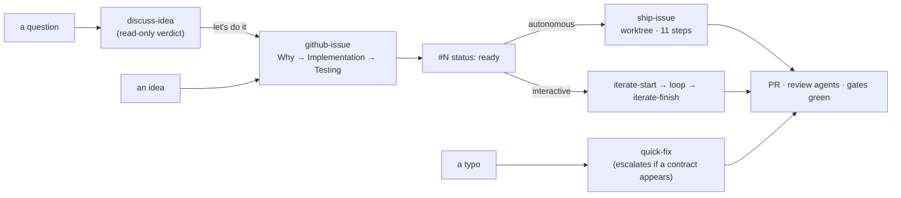

# AIScaffolding

**A production-grade agent workflow for a real codebase.** Drop-in `CLAUDE.md`, skills, agents, and the two paired planning documents that turn "an AI wrote some code" into "a change that passes the same gates a senior engineer would insist on."

This is not a prompt collection. It is a **flow**: a GitHub issue is refined into a fixed shape, implemented in an isolated worktree through an ordered sequence of steps, tested at the level the feature lives, reviewed by specialist agents *before* the PR opens, recorded in a ledger, and closed out — with every gate either satisfied or explicitly, visibly deferred.

It was extracted from the working setup of a multi-tenant SaaS product built this way for over a year, generalized and anonymized. Every "this specific thing has bitten us" note in the skills is real.

---

## What's in the box

```
template/                     ← copy this into your repo
  CLAUDE.md                   the gates (§1–§8) + the skill index
  requirements.md             the aspirational spec (template)
  completed.md                the shipped-behaviour ledger (template)
  .claude/
    settings.json             sanitized project settings
    agents/                   7 specialist subagents the flow dispatches
    skills/                   25 skills
docs/
  the-flow.md                 how the flow works and why each step is where it is
  skills-reference.md         every skill: when it applies, the rule that bites
  issue-tracking.md           the GitHub Issues + labels contract (and swapping trackers)
  customizing.md              the ~1 hour of decisions to make it fit your project
install.sh / install.ps1      copy the template into a target repo
```

## Quick start

```bash
git clone https://github.com/Colix-AB/AIScaffolding
cd AIScaffolding

./install.sh /path/to/your/repo          # or: ./install.ps1 C:\path\to\your\repo
```

Then, in your repo:

1. **Create the labels** (one command block — see [`docs/issue-tracking.md`](docs/issue-tracking.md)).
2. **Fill in the placeholders.** `grep -rn "<[A-Z]" CLAUDE.md .claude/skills/` finds every decision the scaffold needs from you.
3. **Rewrite `stack-conventions/SKILL.md`** for your stack. It's the one skill that must be yours.
4. **Delete the gates that don't apply** — §8 if you have one host, the flag skills if you have no flag system. [`docs/customizing.md`](docs/customizing.md) walks the whole list.
5. Try it: `create an issue for <something small>`, then `ship #<N>`.

---

## The flow

Two paths, one bar.



**`ship-issue`** — autonomous, end to end, in a throwaway worktree:

> gate the issue → claim it → worktree from latest `main` → plan (*is it already built? is it stranded on a dead branch?*) → design the contract + API spec → backend → **tests that pin the wire contract** → frontend → multi-host parity → e2e → ledger + docs → lint/tests/build/security self-check → `code-reviewer` + `api-security-audit` (**wait for them**) → PR → tear the worktree down

**`iterate-start` → loop → `iterate-finish`** — the same bar, met at the end instead of along the way, on a normal branch in the developer's own checkout so their dev servers keep working. The expensive decisions (contract, security, parity, flag) are settled *before the first edit*; everything else is queued in an obligation ledger at `.claude/dev-notes/<branch>.md` and discharged by `iterate-finish`, which reconstructs scope **from the real diff** rather than from the conversation.

Full walkthrough, with the reasoning for each step's position: [`docs/the-flow.md`](docs/the-flow.md).

---

## The gates

`CLAUDE.md` is the contract. Skills cite these by number, so keep the numbering stable.

| § | Gate |
| - | ---- |
| **1** | **Production-ready or it doesn't merge** — security, scalability, maintainability on every change |
| **2** | Functional changes update **`requirements.md`** (when scope shifts) **and `completed.md`**, in the same commit |
| **3** | **Fix the root cause** — one behaviour, one implementation; never a second parallel path, and never "unify" by deleting capability |
| **4** | One linter, and it's a **gate** — never hand-pick style |
| **5** | **No AI attribution** in any commit, PR, or branch metadata |
| **5.5** | Dependent work ships as a real **GitHub stack**, never a hand-retargeted base |
| **5.6** | Worktrees live in **`.worktrees/`**, torn down once the PR opens; the primary checkout is the developer's |
| **6** | **Comments are a last resort** — ~10 words, the *why*, never the *what* |
| **7** | **Propose the real solution** — no stopgaps, no "good enough for now" |
| **8** | **Multi-host parity in the same PR, or no ship** — a 🟡 "second host later" entry is forbidden |

The two documents are the memory that makes this work over months:

- **`requirements.md`** — the aspirational spec. What the system *should* do, numbered permanently, larger than what's shipped.
- **`completed.md`** — the ledger. What is *actually* implemented, ✅ / 🟡 / ❌, with file paths and test names as evidence — **and reversals recorded**, so nobody re-proposes a design the team already tried and backed out.

---

## The main skills

Full table with the rule that bites for each: [`docs/skills-reference.md`](docs/skills-reference.md).

**Flow** — `github-issue` · `ship-issue` · `ship-issues` · `quick-fix` · `iterate-start` · `iterate-finish` · `discuss-idea`

**Standards** — `code-quality` · `stack-conventions` · `rest-api-design` · `relational-db-design` · `backend-endpoints` · `endpoint-security` · `openapi-contract` · `wire-casing` · `cross-host-parity` · `lockstep-contracts` · `pragmatic-dependencies` · `config-and-secrets`

**Feature flags** — `feature-flags` · `remove-feature-flag`

**Maintenance** — `using-git-worktrees` · `resolve-merge-conflicts` · `pr-maintenance` · `release-notes`

A few that carry more weight than their size suggests:

- **`endpoint-security`** — auth is default-deny at *one* choke point; an anonymous route is an explicit allowlist entry with a written justification; every write is scoped **in the `where` clause**, not merely pre-checked; cross-scope probes 404 rather than 403. This exists because admin surfaces have shipped reachable to anonymous callers with a forged scope header.
- **`wire-casing`** — one casing end to end, exactly one static mapping boundary, and **no runtime key-rewriter**. A recursive key-walker plus a denylist is what *causes* casing drift; reintroducing one is the forbidden regression.
- **`lockstep-contracts`** — the generic pattern for any concept written down in more than one place (a permission list, a hand-walked entity allowlist, locale bundles, a registry the build scans). These drift silently: nothing fails to compile when a site is missed. Includes the trap where the last site isn't in the repo at all — it's a database row.
- **`discuss-idea`** — read-only, cites `file:line`, argues against itself before finishing, and gives a **verdict**. "Here are four pros and four cons" is a non-answer.
- **`resolve-merge-conflicts`** — resolve by **intent**, never by picking a side, and remember that a clean text merge is not a correct merge: the base may have added callers of a symbol your branch renamed, and that auto-merges with zero markers.

And seven specialist agents the flow dispatches — `backend-architect`, `backend-developer`, `frontend-developer`, `test-engineer`, `ui-ux-designer`, `code-reviewer`, `api-security-audit`. The flow **only** dispatches agents defined in the project, because a global agent's instructions don't carry these gates.

---

## Design decisions worth knowing

**Why an issue tracker at all?** Because the issue is where the up-front decisions live. The Why is the requirement, the Implementation is the plan-at-altitude, the Testing section is what the test steps must assert, and the decision lines (`**Flag:**`, and any you add) are the calls that are expensive to retrofit. Untracked work skips all four.

**Why labels instead of a Projects board?** Zero setup, works in any repo, and `gh` reads it in one call. A Projects `Status` field works identically — see [`docs/issue-tracking.md`](docs/issue-tracking.md).

**Why worktrees?** The developer's checkout is *live*. They switch branches and run dev servers in it while the agent works; a `git checkout` there can destroy uncommitted work, and `git stash` is worse because the stash stack is shared across worktrees. One canonical `.worktrees/` home, torn down after the PR opens.

**Why two planning documents rather than one?** Because "what we intend" and "what actually ships" answer different questions, and merging them produces a document that is either dishonest or useless. The split is also what makes 🟡 meaningful: an entry with a named gap is information; a spec with an unmarked hole is a trap.

**Why is parity (§8) stricter than everything else?** Because it's the gate a schedule most wants to break, and "web now, native next sprint" is how two renderers silently become two products. So it overrides even the 🟡-partial allowance: no parity, no PR.

**Why do the review agents run *before* the PR opens?** A finding that lands on an already-merged PR costs a recovery PR. That has happened; the ordering is the fix.

---

## Contributing

Issues and PRs welcome — especially:

- **A concrete failure a skill should have prevented.** The most valuable content here is the "this bit us" notes; they only exist because someone wrote them down the second time.
- **Adapters for other trackers** (Jira, Linear, Shortcut) following the five-call contract in [`docs/issue-tracking.md`](docs/issue-tracking.md).
- **Stack variants** of `stack-conventions` (Python/Django, Go, Rails, .NET).

If you change a skill, keep the shape: trigger-shaped description, the concrete failure it prevents, a numbered flow, and a reviewer checklist that says what makes a PR **incomplete**.

## Licence

MIT — see [LICENSE](LICENSE).

Two exceptions live in `template/.claude/agents/`: `ui-ux-designer.md` is CC BY 4.0 by [Madina Gbotoe](https://madinagbotoe.com/) (attribution required — keep the header block), and the remaining role prompts carry no authorship header. See [NOTICES.md](NOTICES.md).
