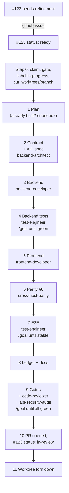
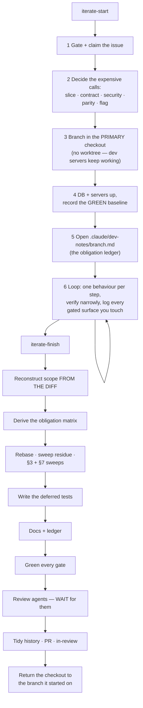

# The Flow

Two ways to build a change, one bar for both. This document explains what the flow does, why each step is where it is, and which failure it prevents.

---

## The bar (CLAUDE.md §1–§8)

Everything else is scheduling. These are the gates:

| § | Gate | Enforced by |
| - | ---- | ----------- |
| 1 | Production-ready — security, scalability, maintainability | `endpoint-security`, `code-quality`, review agents |
| 2 | Functional changes update `requirements.md` + `completed.md` | flow step "Ledger" |
| 3 | Fix the root cause; one behaviour, one implementation | `discuss-idea`, the §3 sweep in `iterate-finish` |
| 4 | One linter, and it's a gate | flow step "Gates" |
| 5 | No AI attribution in VCS metadata | every flow's commit step |
| 5.5 | Dependent work ships as a real GitHub stack | `ship-issue` step 0.5, `iterate-finish` step 10 |
| 5.6 | Worktrees live in `.worktrees/`, torn down after the PR opens | `using-git-worktrees` |
| 6 | Comments are a last resort | `code-quality` |
| 7 | Propose the real solution, never a stopgap | the §7 sweep in `iterate-finish` |
| 8 | Multi-host parity, in the same PR, or no ship | `cross-host-parity` |

A gate that "applies but was skipped" makes the change **incomplete** — not merged-with-a-note.

---

## Path A — autonomous: `ship-issue`

Use it when the work is well specified and you want it delivered end to end without supervision.



**Why this order.** Each step's output is the next step's input, and the expensive-to-retrofit decisions come first:

- **The gate before the work** (step 0). An unrefined issue produces an unfocused change. Claiming it first stops two people building the same thing.
- **The worktree before the first edit.** The developer's checkout is live; branching in it races them.
- **"Is it already built?" before planning.** The single most common waste is rebuilding something that shipped — or that is *stranded* on a branch whose squash-merge never reached `main`.
- **Contract before code** (step 2). A contract discovered by iteration is exactly how a casing or envelope regression ships.
- **Tests before the frontend** (step 4 before 5). The backend test pins the wire contract, so the frontend is written against something proven rather than something remembered.
- **Parity before e2e** (step 6 before 7). Adding the second host later means re-testing the flow twice.
- **Review before the PR** (step 9). A review finding on a merged PR costs a recovery PR.
- **Teardown after the PR opens** (step 11), because the work is on the remote and the worktree has done its job.

### `/goal` checkpoints

Three steps end in "keep going until X is true": the backend tests (4), the e2e spec (7), and the full gate set (9). Set `/goal <condition>` there and Claude keeps fixing and re-running instead of stopping at the first red. Clear the goal once it holds so it doesn't leak into the next phase.

### Many issues at once

`ship-issues` runs the same flow concurrently: one worker agent per issue, one worktree each, 2–4 at a time. The orchestrator gates every issue first, then **serializes every step that touches a shared singleton** — the test database and the e2e ports are not per-worktree, and two runs against them produce phantom failures.

---

## Path B — interactive: `iterate-start` → loop → `iterate-finish`

Use it when the developer wants to see and steer each step, or when the shape of the feature will be discovered by trying it.



**What's different, and what isn't.** The bar is identical. What changes is *when* each gate runs:

- **Front-loaded:** everything expensive to retrofit — the slice, the contract + spec, the security posture, the parity posture, the flag decision. Discovering a contract change on commit nine is the failure this prevents.
- **Deferred but recorded:** every other gate becomes an explicit line in `.claude/dev-notes/<branch>.md`. A deferred gate is *queued with evidence*, never dropped.
- **No worktree, on purpose.** The developer's editor, dev servers, and browser tabs point at this checkout. `iterate-finish` returns it to where it started — that step replaces the worktree teardown.
- **The diff is the truth at the end.** `iterate-finish` reconstructs scope from `git diff origin/main...HEAD`, not from the notes file and not from the conversation — because the notes record what the loop *remembered* to log.

### The obligation ledger

The mechanism that makes deferral safe. When a loop step touches something in the left column, the right column is appended to the notes file — mechanically, in the same step:

| Touched | Obligation |
| ------- | ---------- |
| Route / controller / service | Backend test pinning the wire contract + anonymous-refused + cross-scope 404 |
| Endpoint shape / status / auth scheme | API-spec edit + regen + validate |
| Schema | Migration, column mapping, indexes |
| Shared component / generator | Parity in this branch + the parity test |
| A published package interface | Semver bump + docs + every mirrored copy |
| A new env var | Dev template + production provisioning |
| A user-facing flow | E2E spec, mutation-checked |
| A tracked requirement | `completed.md` (+ `requirements.md` if scope shifted) |

`iterate-finish` takes the **union** of that list and the matrix it derives from the real diff, and discharges all of it.

---

## Path C — small: `quick-fix`

A typo, a wrong constant, a casing slip, a CSS nudge, a missing null-check. Locate → root-cause fix → test the touched code → green the gates, in a worktree.

**It escalates.** The moment a contract, wire shape, widget/shared surface, or auth rule is in play, `quick-fix` hands off to `ship-issue`. That escape hatch is the whole reason the slim path is safe to have.

## Path D — think first: `discuss-idea`

Read-only. Grounds every claim in the real code with `file:line` citations, checks the idea against the gates and against decisions already made and reverted, gives a **verdict** rather than a both-sides list, prices it concretely — then hands off to `github-issue` / `ship-issue` / `quick-fix` only when the user says to build it.

Its most useful move is finding that a design was already tried and backed out. That's why `completed.md` records reversals.

---

## Maintenance flows

| Flow | When |
| ---- | ---- |
| `resolve-merge-conflicts` | A PR shows `CONFLICTING`. Merges the base in inside a worktree, resolves **by intent** (never by picking a side), sweeps for the semantic breakage a clean auto-merge hid, proves it, confirms `MERGEABLE`. |
| `pr-maintenance` | Scheduled triage of one author's open PRs: trivial conflicts, small review-comment fixes, squash-merging approved PRs. Conservative — it flags substantive comments instead of pushing. |
| `remove-feature-flag` | A flag has finished its rollout. Decide the surviving branch, remove the gate, delete the registry entry **and** the runtime row, atomically. |
| `release-notes` | One user-facing entry per deploy window, mined from git history, excluding infrastructure work, vulnerability disclosures, and flag-gated work that isn't on yet. |

---

## Choosing a path

```
Is the user asking a question rather than giving an instruction?      → discuss-idea
Is it a one-liner with an understood cause and no contract in play?   → quick-fix
Is a flag being retired?                                             → remove-feature-flag
Will the developer steer it step by step, in their own checkout?      → iterate-start / iterate-finish
More than one independent issue in this run?                          → ship-issues
Otherwise                                                             → ship-issue
```

When two paths could apply, take the stricter one. `quick-fix` escalating to `ship-issue` costs minutes; a contract change that skipped the contract step costs a rollback.
